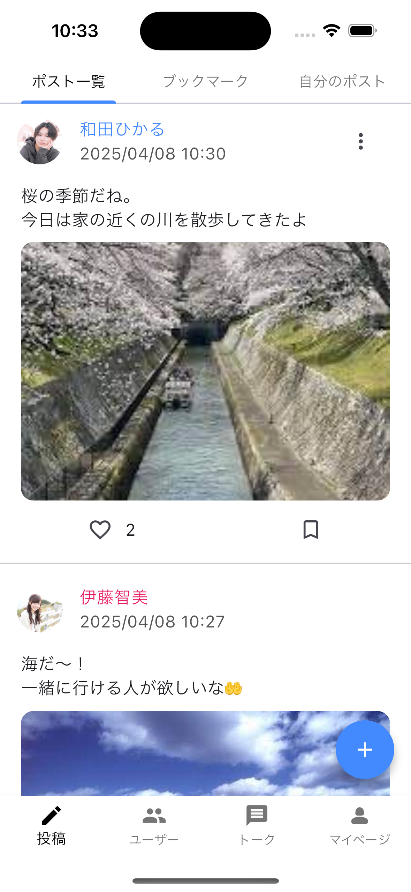
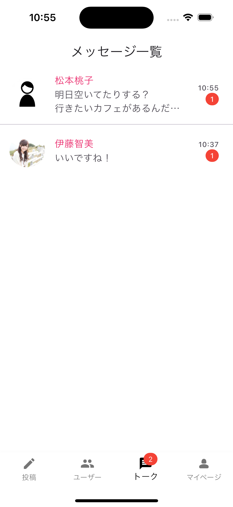

# このアプリについて
このアプリは、私が参加していた長期インターン先で行った研修の最終課題です。  
役1ヶ月半にわたる研修で、FlutterとFirebaseを用いたアプリ開発を一から学びました。  
研修では、以下のパッケージやMVCモデル、ER図、デザインについても学びました。  
go_router: 画面遷移  
riverpod: 状態管理  
freezed: DBのモデル定義  

この研修の最終課題でこちらのマッチングアプリを作成しました。

# 実際にこのアプリを使用する方法
1. `git clone https://github.com/HayashidaReo/training_matting_app.git`
2. `cd path_to_training_matching_app`
3. `flutter pub get`
4. `dart pub global activate flutterfire_cli`
5. `flutterfire configure`で質問に答える
   1. `Select a Firebase project to configure your Flutter app`  
   既存のプロジェクトか新規で作成する
   2. `Which platforms should your configuration support (use arrow keys & space to select)?`  
   androidとiosだけ選択する
6. 作成された`firebase_options.dart`を`lib/config/firebase/`に移動
7. `flutter run`かデバッグでアプリを起動

# アプリUI
## 会員認証まわり

   
   
   

## ポスト投稿

   
   

## マッチング

   
   
   

## トーク

   
   

## マイページ

   
   
   

